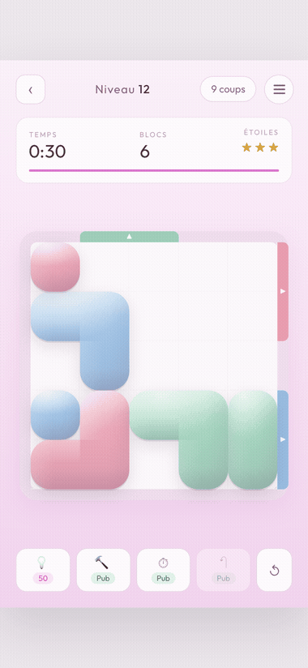
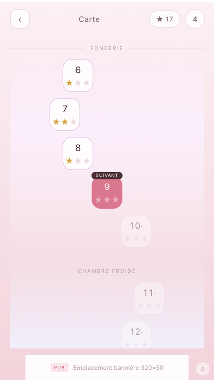
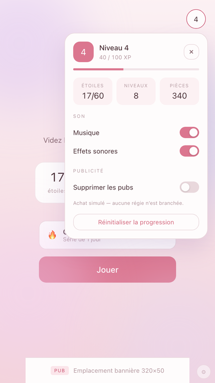
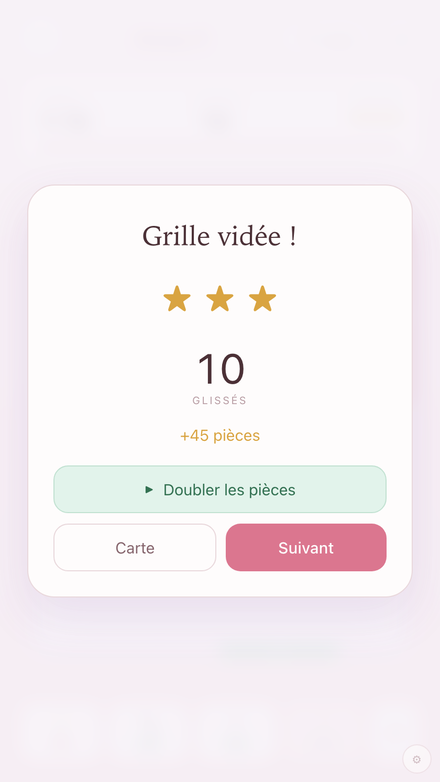
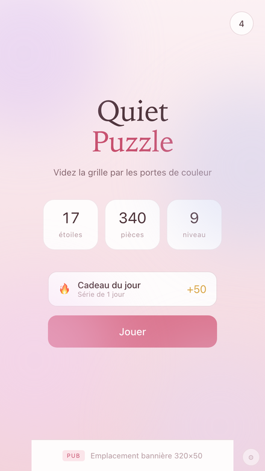
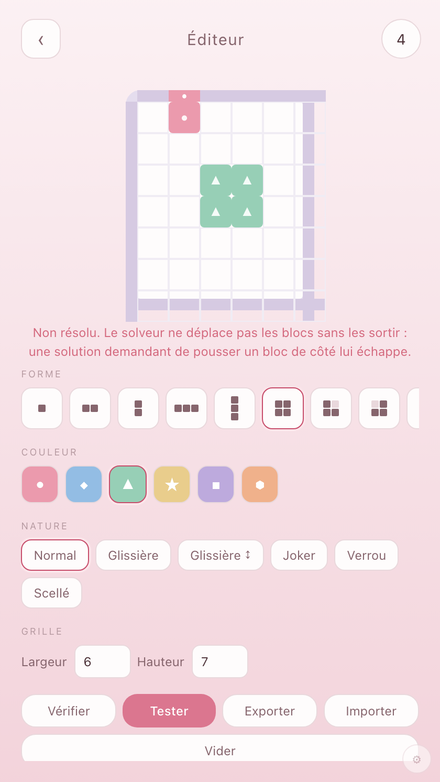

# Quiet Puzzle

**Un casse-tête pour décompresser.**

Pas de score à battre, pas d'adversaire, personne qui vous attend. Une grille,
des blocs de couleur, et des portes sur les murs. On attrape un bloc, on le fait
glisser, il sort. Le geste est simple et se répète — c'est exactement ce qu'on
cherche quand la journée a été dense : quelque chose qui occupe les mains et
laisse l'esprit se poser.

Tout est réglé pour ça. La palette pastel glisse lentement du rose au vert d'eau
à mesure qu'on avance dans les niveaux. La musique d'ambiance est jouée au
piano et à la boîte à musique, et change de caractère toutes les vingt secondes
pour ne jamais tourner en rond. Chaque bloc qui franchit sa porte fait sonner un
carillon, un ton plus haut que le précédent : enchaîner devient une petite
mélodie.

Il y a bien un chronomètre — il faut une contrainte pour qu'un puzzle en soit un
— mais il est large, et une pub récompensée le rallonge quand il serre trop.

**▶ Jouer : https://romumrn.github.io/Quiet-puzzle/**



## Comment on joue

Un bloc suit le doigt case par case et s'arrête au premier obstacle. Plaqué
contre une porte de **sa** couleur, et s'il y tient en largeur, il quitte la
grille — une forme de trois cases ne passe pas par une porte de deux. Objectif :
vider le plateau.

Sur la route : des blocs montés sur glissière qui ne vont que sur un axe, des
blocs scellés qu'il faut contourner, des blocs verrouillés qui s'ouvrent après
un certain nombre de sorties, et des portes à capacité limitée — y envoyer le
mauvais bloc gâche de la place.

| Le plateau | La carte | Le profil |
|---|---|---|
|  |  |  |

| Grille vidée | Le menu | L'éditeur de niveaux |
|---|---|---|
|  |  |  |

## Le dépôt

Prototype web, sans dépendance ni build : HTML, CSS et JavaScript natifs.

| Dossier | Contenu |
|---|---|
| `prototype/` | Les sources, modulaires — c'est ici qu'on travaille |
| `docs/` | Le fichier unique servi par GitHub Pages, produit par le bundler |
| `media/` | Captures et animations du README, régénérables |

## Développer

```bash
cd prototype && python3 -m http.server 8123
```

```bash
node tools/test.mjs
```

Les tests **prouvent que chaque niveau est résoluble** : ils rejouent la solution
de référence sur le vrai moteur, puis un solveur indépendant revide les grilles
sans lire cette solution.

```bash
node tools/balance.mjs
```

Affiche pour chaque niveau la densité, l'éloignement moyen des blocs à leur
porte, les limites, et le nombre d'états explorés par le solveur — la mesure de
difficulté.

```bash
python3 tools/music.py
```

Régénère la musique et les carillons. Le tirage est seedé : le résultat est
identique à chaque fois.

```bash
node tools/captures.mjs
```

Refait les images de ce README en pilotant Chrome en headless. Chaque capture
part d'une sauvegarde fabriquée et d'un niveau donné, jamais d'une partie jouée
à la main : elles restent donc à jour après une modification de l'interface.

## Publier

```bash
cd prototype && node tools/bundle.mjs && cp dist/standalone.html ../docs/index.html
```

Puis commiter `docs/index.html`. Le workflow `.github/workflows/pages.yml` fait
la même chose automatiquement à chaque push sur `main`.

Toute la documentation de conception — règles, génération des niveaux,
équilibrage, monétisation, correspondance avec l'architecture Unity visée — est
dans [prototype/README.md](prototype/README.md).
