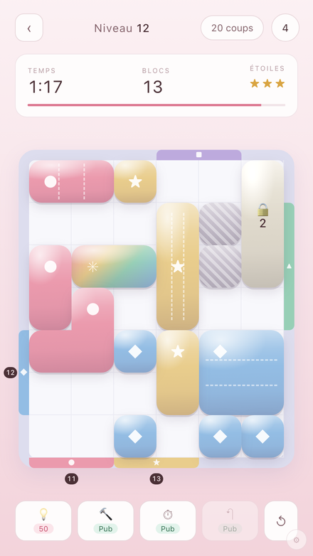

# Quiet Puzzle — prototype jouable

Prototype web du jeu décrit dans `../Document_Technique_Developpeurs.md`.
Genre : **puzzle de blocs à faire sortir par des portes de couleur**.

L'intention tient en une phrase : offrir un casse-tête où l'on décompresse.
Pas de score à battre ni d'adversaire — un geste simple et répétable, qui occupe
les mains et laisse l'esprit se poser après une journée dense. Cette intention
n'est pas décorative, elle tranche des arbitrages concrets tout au long de ce
document : le chronomètre reste large, la palette évolue lentement, la musique
change de caractère pour ne pas tourner en rond, et les publicités sont cadencées
pour ne jamais couper un joueur au moment où il veut recommencer.



Il sert deux objectifs :

1. **Valider le game design** — le document technique décrit toute
   l'infrastructure (Unity, backend Node, monétisation, CI/CD) mais laisse la
   mécanique à l'état de placeholder. Ce prototype tranche les règles et permet
   de les jouer immédiatement.
2. **Servir de spécification exécutable** — chaque module porte le nom de son
   homologue C# de la section 4 du document, pour que le portage Unity soit un
   mapping et non une réinterprétation.

## Lancer

Un serveur statique suffit — aucune dépendance, aucun build.

```bash
cd prototype && python3 -m http.server 8123
```

```bash
node tools/test.mjs
```

```bash
node tools/balance.mjs
```

```bash
node tools/bundle.mjs
```

## Règles

**Plateau** — une grille close par des murs. Sur ces murs sont posées des
**portes** de couleur, larges de 2 ou 3 cases.

**Blocs** — des polyominos colorés (de 1 à 4 cases). On attrape un bloc et on le
fait glisser : il suit le doigt case par case et s'arrête au premier obstacle.

**Sortie** — un bloc quitte le plateau lorsqu'il est plaqué contre une porte de
**sa** couleur et qu'il y tient en largeur : une forme de 3 cases ne passe pas
par une porte de 2. C'est la mise en œuvre de `AreAllDoorsComplete()`, laissé en
placeholder au §5.1 du document.

**Objectif** — vider la grille de tous ses blocs déplaçables.

**Double contrainte** — un chronomètre **et** un nombre de glissés. Le premier
des deux épuisé fait perdre. Un glissé n'est décompté que s'il a réellement
déplacé un bloc : tâtonner contre un mur ne coûte rien.

**Types de blocs** — les effets reprennent des mécaniques éprouvées du genre
plutôt que d'en inventer :

| Type | Comportement |
|---|---|
| Normal | Sort par une porte de sa couleur. |
| Glissière | Ne se déplace que sur un axe, comme dans *Rush Hour*. C'est de loin le type qui crée le plus de difficulté sans ajouter de règle à expliquer. |
| Joker | Multicolore : sort par n'importe quelle porte. Sert de soupape quand la grille est trop contrainte. |
| Verrouillé | Scellé jusqu'à ce que N blocs soient sortis. Le bloc affiche « Encore N », qui décompte en direct. |
| Scellé (gris) | Ne bouge jamais, il faut le contourner. |

**Portes à capacité** — à partir du niveau 8, une porte n'accepte qu'un nombre
limité de cases, affiché dessus. C'est le seul mécanisme qui crée un véritable
casse-tête : voir « Ce qui fait la difficulté » plus bas.

**Étoiles** — 1★ grille vidée, 2★ et 3★ selon l'économie de gestes par rapport à
la solution de référence. Le chrono et la limite de coups restent des conditions
de défaite, pas des barèmes : mêler les deux rendait la note illisible.

## Ce qui fait la difficulté

Une découverte contre-intuitive, mesurée par le solveur : **sans portes à
capacité, aucun ordre de sortie ne peut être mauvais**. Sortir un bloc ne fait
que libérer de la place, donc tout choix glouton mène à la victoire — le solveur
vidait les grilles sans jamais revenir en arrière, quelle que soit leur densité.

Les leviers réellement efficaces, dans l'ordre :

1. **Portes à capacité** — router un bloc vers la mauvaise porte de la bonne
   couleur gâche des cases. C'est ce qui oblige à planifier.
2. **Blocs bridés en déplacement** — glissières (un axe) et ancres (un seul
   sens) : un bloc qui ne peut pas s'écarter impose un ordre.
3. **Encombrants** — ils coûtent le double à leur porte, et la saturent plus
   vite que leur taille ne le laisse croire.
4. **Densité** — 60 à 70 % des cases occupées ; en dessous, la grille se lit
   d'un coup d'œil.
5. **Verrous et limites** de coups et de temps.

`tools/balance.mjs` affiche le nombre d'états explorés par le solveur : c'est la
mesure de « combien de retours en arrière » un joueur devra faire, et donc le
meilleur indicateur de difficulté disponible.

## Économie

Les gains ont été divisés par quatre après playtest : un premier 3★ rapporte 23
pièces, un 1★ onze, un niveau rejoué trois. Les **tarifs n'ont pas bougé**
(indice 50, continuer 120) — c'est le rapport entre les deux qui fait
l'économie. À l'ancien barème, un joueur ordinaire payait un indice tous les
deux niveaux sans y penser, et un bonus qu'on peut toujours s'offrir ne se
choisit plus.

## Monétisation

Toute la plomberie publicitaire est en place, prête à recevoir AppLovin MAX
(doc §5.2). Les pubs sont **simulées** par un panneau plein écran avec décompte,
pour que l'emplacement et le rythme soient jugeables avant tout contrat régie.

Le travail n'est pas l'intégration du SDK, qui est mécanique, mais le
**cadencement** — `src/monetization/adPolicy.js`, logique pure et testée :

- aucune interstitielle avant le niveau 3, ni sur la **première défaite** d'un
  niveau : c'est exactement le moment où le joueur veut recommencer, et
  l'interrompre là est le meilleur moyen de le faire quitter ;
- 90 secondes minimum entre deux, une fin de niveau sur deux, et jamais juste
  après une pub récompensée ;
- bannière au menu et sur la carte uniquement — **jamais pendant une partie**,
  où elle volerait de la place au plateau et provoquerait des clics accidentels
  en plein glissé ;
- chaque pub non affichée est journalisée avec sa raison : on doit pouvoir
  expliquer ce qui ne s'est pas affiché.

**Bonus contre pub récompensée** : marteau (retirer un bloc au choix),
+30 secondes, annulation du dernier geste. L'indice se paie en pièces et bascule
sur une pub quand le joueur est fauché — mieux vaut une pub qu'un joueur bloqué
qui désinstalle.

**Offre de continuation** (`FailOfferController.cs` dans le document, désigné
comme monétisation critique) : à la défaite, on propose de repartir avec +30 s et
+3 coups contre une pub ou des pièces. Deux garde-fous délibérés — l'offre n'est
proposée **qu'une fois par tentative**, et « Abandonner » est un bouton normal,
pas un lien minuscule.

**Rétention** : série quotidienne à récompense croissante, message de proximité
à la défaite (« il ne restait qu'un bloc ! »), reprise immédiate, doublement des
pièces par pub à la victoire.

## Puzzle du jour

L'éditeur a quitté le panneau QA — où il voisinait « Gagner » et « Perdre », et
où aucun joueur ne l'aurait trouvé — pour le **menu utilisateur**, à côté des
réglages. Une grille qu'on y dessine peut être **proposée comme puzzle du
jour** : le solveur la vérifie au dépôt, elle rejoint une file, et chaque jour
une proposition en est tirée — le tirage est seedé sur la date, donc le même
pour tout le monde.

Le score mêle rapidité et économie de gestes, dans cet ordre : on part d'un
socle de 1000, on retire 25 points par geste superflu puis 2 points par seconde.
Un joueur qui réfléchit longtemps mais joue juste passe donc devant un joueur
rapide et brouillon — c'est la hiérarchie qu'un jeu de réflexion doit
récompenser. Le score ne descend jamais sous 100 : une grille finie vaut
toujours mieux qu'une grille abandonnée.

Deux limites à connaître, et le jeu les dit à l'écran :

- **le classement est local à l'appareil.** `src/meta/dailyPuzzle.js` tient le
  rôle qu'un backend tiendra, derrière les signatures qu'auront les routes REST
  (`submitDailyPuzzle`, `getDailyPuzzle`, `submitDailyScore`,
  `getDailyLeaderboard` dans `src/data/api.js`). Il n'y a pas de serveur à qui
  envoyer les scores, et le prototype ne fait semblant de rien ;
- **l'auteur est un jeton tiré au sort**, pas une adresse IP. Une page web ne
  connaît pas sa propre IP : seul le serveur qui reçoit la requête la voit. Le
  champ `auteur` est à la bonne place, prêt à la recevoir côté serveur ; le
  remplir depuis le navigateur demanderait d'interroger un service tiers à
  chaque partie.

Le score est recalculé dans `api.js` à partir des chiffres de la partie, jamais
repris de ce que l'appelant annonce — un score que le client fournit est un
score qu'il choisit. Le vrai serveur devra faire de même.

## Éditeur de niveaux

Accessible depuis le panneau QA. On dépose des formes, on choisit couleur et
nature, on ouvre des portes en touchant les murs, puis **Vérifier** interroge le
solveur : un niveau dessiné à la main n'est jamais livré sans preuve qu'il tient
debout. **Tester** le joue immédiatement, **Exporter** produit le JSON au format
`GET /api/level/{n}`.

Portée du solveur : il cherche dans quel **ordre** sortir les blocs, chaque bloc
rejoignant sa porte par un chemin trouvé en largeur. Il n'explore pas les
déplacements d'appoint — pousser un bloc de côté sans le sortir. Un « non
résolu » signifie donc « aucune solution de cette forme », pas « insoluble », et
le message le dit.

**Lisibilité** — chaque couleur porte un glyphe (●, ◆, ▲, ★, ■, ⬢) repris à
l'identique sur sa porte. L'appariement bloc/porte reste lisible sans dépendre de
la teinte.

## Génération des niveaux : à l'envers

C'est le cœur du générateur. Plutôt que de poser des blocs au hasard en espérant
que la grille soit résoluble, chaque bloc **entre par sa porte puis recule** dans
la grille. Trois conséquences :

- **Tout niveau est résoluble par construction.** L'ordre de résolution est
  l'inverse de l'ordre de pose : le dernier bloc posé sort en premier, et son
  chemin est libre puisqu'il a été creusé alors que seuls les blocs précédents
  étaient présents.
- **La solution de référence est gratuite** — elle sert aux tests, à
  l'équilibrage, au bouton « Résoudre » du panneau QA, et servira aux indices.
- **Les verrous restent cohérents** : un bloc n'est verrouillé que par une
  condition déjà remplie au moment où la solution lui demande de bouger.

Le RNG est seedé : le niveau *n* produit toujours la même grille, sur toutes les
machines. Le générateur ne tourne cependant plus dans le jeu : `node
tools/build-levels.mjs` écrit la base `levels/` (un index, un fichier par
monde), et l'application ne fait que la lire. Un niveau peut donc être retouché
à la main sans qu'une exécution l'écrase, et les niveaux livrés sont exactement
ceux qui ont été testés.

La progression tient en **dix-huit mondes de vingt niveaux**, et un monde entier
tient dans une ligne de la table `REALMS` : sa palette, sa teinte, le type de
bloc qu'il introduit, et les quantités notées `[début, fin]` qu'on interpole sur
ses vingt niveaux. La difficulté monte donc DANS le monde et fait un palier
ENTRE les mondes — une mécanique s'apprend avant d'être combinée à la suivante.

La marche à suivre pour ajouter des niveaux, palier par palier, avec les
garde-fous à vérifier après coup, est dans
[docs/creation-de-niveaux.md](docs/creation-de-niveaux.md).

## Équilibrage

Deux constats mesurés, qui ont chacun corrigé une erreur de conception :

1. **Compter les changements de direction surestimait le coût de 60 %.** Un doigt
   qui suit un tracé en L fait tourner le bloc en un seul glissé. `tools/balance.mjs`
   mesure donc le nombre de gestes réellement nécessaires, en cherchant le point
   le plus lointain atteignable d'un seul glissé.
2. **La difficulté vient de la densité, pas de la longueur des chemins.** Un bloc
   isolé rejoint toujours sa porte d'un seul geste ; ce qui fait réfléchir, c'est
   que les blocs se gênent et imposent un ordre de sortie. Les grilles visent donc
   45 à 65 % de cases occupées.

Chiffres actuels : 7 à 30 blocs par niveau, 65 à 155 secondes, et bien jouer
rapporte 3★ à tous les niveaux.

Une troisième erreur, corrigée en portant la progression à 40 niveaux : **la
limite de coups était calculée indépendamment du barème d'étoiles.** Son plancher
fixe (`minDrags + 5`) garantissait une marge d'erreur tant que la solution tenait
en quinze glissés ; au-delà il passait sous le seuil 3★, et toute victoire valait
alors trois étoiles. Elle se cale désormais au-dessus du seuil 1★, et
`tools/balance.mjs` refuse tout niveau dont les trois notes ne sont pas
atteignables.

## Correspondance avec l'architecture Unity (document §4)

| Prototype | Script C# prévu |
|---|---|
| `src/core/board.js` | `Gameplay/BoardManager.cs` |
| `src/core/block.js` | `Gameplay/BlockController.cs` |
| `src/core/levels.js` | `Gameplay/LevelManager.cs` |
| `src/core/gameState.js` | `Gameplay/GameState.cs` |
| `src/input/input.js` | `Gameplay/InputHandler.cs` |
| `src/render/boardView.js` | `Animation/BlockAnimator.cs` + `VFXManager.cs` |
| `src/core/solver.js` | — (outil d'auteur, pas de portage requis) |
| `src/monetization/adManager.js` | `Monetization/AdManager.cs` |
| `src/monetization/adPolicy.js` | — (cadencement, à porter dans `AdManager`) |
| `src/monetization/failOffer.js` | `Monetization/FailOfferController.cs` |
| `src/monetization/currency.js` | `Monetization/CurrencyManager.cs` |
| `src/data/events.js` | `Backend/EventTracker.cs` |
| `src/ui/screens.js` | `UI/ScreenManager.cs` |
| `src/ui/mapScreen.js` | `UI/LevelScreen.cs` |
| `src/ui/gameplayUI.js` | `UI/GameplayUI.cs` |
| `src/ui/resultScreen.js` | `UI/ResultScreen.cs` |
| `src/data/save.js` | `Utilities/DataManager.cs` |
| `src/data/api.js` | `Backend/APIClient.cs` |
| `src/main.js` | `Managers/GameManager.cs` |

Deux principes rendent ce portage mécanique :

- **`core/` ne touche jamais au DOM.** Chaque geste produit des évènements
  (`move`, `exit`, `unlock`) que `render/` rejoue en animation. La logique tourne
  telle quelle sous Node — c'est ce qui permet à `tools/test.mjs` de **prouver que
  les 360 niveaux sont résolubles** en rejouant leur solution sur le vrai moteur,
  et ce qui donnera la couverture unitaire visée au §10.1.
- **`Board.snapshot()` / `restore()`** permettent d'explorer des coups sans les
  jouer : c'est ce qui mesure l'équilibrage aujourd'hui, et ce qui portera
  l'annulation et les indices demain.

### Backend

`src/data/api.js` expose les endpoints du document §6.1 (`getLevel`,
`completeLevel`, `getProfile`) avec leurs formes de réponse réelles, implémentés
sur `localStorage`. Les objets de niveau respectent le format de
`GET /api/level/{levelNumber}`. Brancher le vrai serveur revient à remplacer le
corps de ces trois fonctions par un `fetch`, sans toucher à un seul appelant.

## Langue et accessibilité

L'interface existe en **français, anglais, espagnol, italien et chinois** ; la
langue se choisit dans le menu (☰), et suit celle du navigateur tant que le joueur n'a rien choisi —
enregistrer un défaut aurait figé la langue du premier chargement.
`src/ui/i18n.js` porte un dictionnaire plat, le markup des attributs `data-i18n`,
et `tools/test.mjs` vérifie **quatre** choses : que toutes les tables ont
exactement les mêmes clés, qu'aucune traduction ne perd un paramètre `{n}`,
qu'aucun texte visible ne reste codé en dur dans le markup, et qu'aucun n'est
écrit depuis le CSS.

Les deux derniers contrôles ont été ajoutés après coup, et ils manquaient : les
dictionnaires étaient complets, et pourtant « Suivant » sur la carte, « Fermer »
sur l'écran publicitaire et « Doubler les pièces » restaient français dans
toutes les langues. Une chaîne oubliée dans le markup — ou, pire, écrite en CSS
par `content: 'Suivant'`, hors de portée de toute traduction — ne se voit
qu'en jouant, et seulement dans une langue qu'on ne parle pas soi-même.

Les mondes voyagent traduits dans le catalogue (`name`/`nameEn`), de sorte que
l'interface n'a rien à savoir du générateur pour se traduire.

Les six familles de blocs se distinguent normalement à la couleur seule. L'option
**« Symboles sur les blocs »** leur rend leur glyphe (●◆▲★■⬢), sur les blocs
comme sur les portes, pour qui ne peut pas s'appuyer sur la teinte.

## Menu utilisateur

Le bouton rond en haut à droite est présent sur **tous** les écrans, y compris
en pleine partie : couper le son ne doit pas obliger à abandonner un niveau. Il
affiche le niveau global du joueur, et porte une pastille quand le son est
coupé — l'état doit se lire sans avoir à ouvrir le panneau.

Le panneau donne le niveau global et sa progression en XP, les étoiles, les
niveaux terminés et les pièces ; puis les réglages : musique et effets sonores
**séparément** (un réglage unique est trop grossier — beaucoup de joueurs
veulent garder le retour sonore de leurs actions sans la musique), la
suppression des pubs, et la réinitialisation de la progression.

## Panneau QA

L'engrenage en bas à droite permet de sauter à un niveau, forcer une victoire ou
une défaite, **rejouer la solution de référence** (contrôle visuel du
générateur), tout débloquer et accélérer les animations.

## Identité visuelle

Rose pastel, sobre. Toute la chromie de l'habillage dérive d'une seule variable
CSS `--h`, qui glisse du rose au vert d'eau à mesure qu'on descend dans les
niveaux (`src/ui/theme.js`) : la carte montre la gradation d'un monde à l'autre,
et chaque niveau adopte sa teinte. **Les couleurs des blocs ne bougent jamais** —
elles portent la règle du jeu, un joueur doit pouvoir les apprendre une fois pour
toutes.

Le parti pris est monochrome clair et assumé : pas de variante sombre, mais tous
les fonds et toutes les couleurs sont peints explicitement, donc la page tient
sur n'importe quel support. Chaque couleur porte aussi un glyphe (●, ◆, ▲, ★, ■,
⬢), repris à l'identique sur sa porte : l'appariement reste lisible sans dépendre
de la teinte.

## Hors périmètre

Volontairement absents : IAP réels (seul « supprimer les pubs » est simulé),
backend réseau, son, et les niveaux 21 à 100 — le générateur les produit déjà,
seul `TOTAL_LEVELS` les limite.
